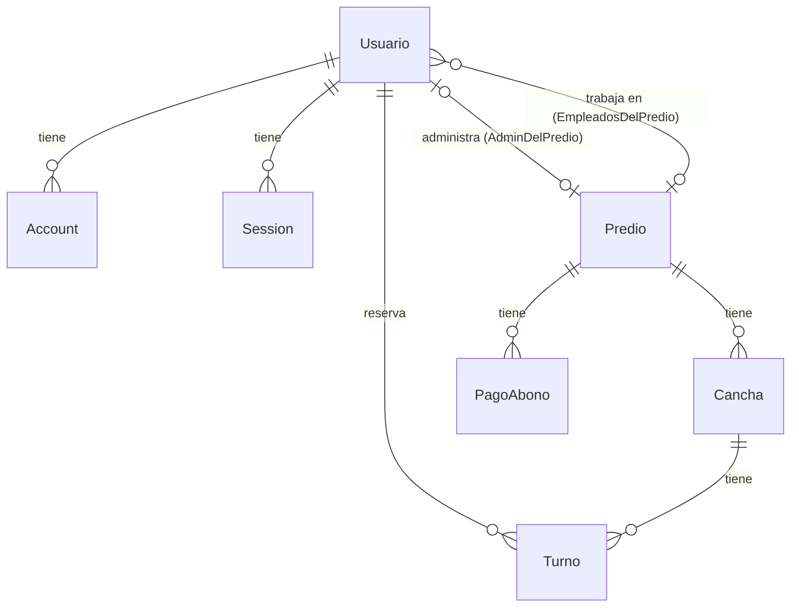

# Base de Datos — PicaditoYa

Documentación del esquema de base de datos PostgreSQL (Supabase) gestionado con **Prisma ORM**.

> [!NOTE]
> Schema Prisma: [`prisma/schema.prisma`](file:///c:/Users/julian/Documents/PicaditoYa/PicaditoYa/prisma/schema.prisma)
> Conexión: Supabase PostgreSQL (Transaction pooler en puerto 6543, Session mode en 5432 para migraciones)

---

## Diagrama de Relaciones

---

## Enums

| Enum | Valores |
|------|---------|
| `RolUsuario` | `super_admin`, `admin`, `empleado`, `cliente` |
| `EstadoPredio` | `activo`, `inactivo`, `pendiente_pago` |
| `EstadoTurno` | `confirmado`, `cancelado_a_tiempo`, `cancelado_tarde`, `completado`, `no_show` |
| `EstadoPago` | `pagado`, `pendiente` |

---

## Tablas del Dominio

### `usuarios`
Usuarios de la plataforma (clientes, admins de predio, empleados, super_admin).

| Columna | Tipo | Descripción |
|---------|------|-------------|
| `id` | `text PK` | CUID autogenerado |
| `nombre` | `text` | Nombre completo |
| `email` | `text UNIQUE` | Email (login) |
| `emailVerified` | `timestamp?` | Fecha de verificación del email |
| `telefono` | `text?` | Teléfono de contacto |
| `password_hash` | `text?` | Hash bcrypt de la contraseña |
| `image` | `text?` | URL de avatar |
| `rol` | `RolUsuario` | Default: `cliente` |
| `predio_id` | `text? FK → predios` | Solo para `admin`/`empleado`: predio al que pertenece |
| `puntaje_asistencia` | `float?` | Porcentaje 0-100 de asistencia |
| `turnos_totales` | `int` | Total de turnos reservados (default: 0) |
| `turnos_asistidos` | `int` | Turnos a los que asistió (default: 0) |
| `turnos_no_show` | `int` | Turnos que no asistió (default: 0) |
| `fecha_creacion` | `timestamp` | Auto |
| `updated_at` | `timestamp` | Auto |

**Relaciones:**
- `predio` → `Predio` (EmpleadosDelPredio) via `predio_id`
- `predioAdminDe` → `Predio[]` (AdminDelPredio) — un admin puede tener varios predios
- `turnos` → `Turno[]` — turnos reservados como cliente
- `accounts` → `Account[]` — cuentas OAuth (NextAuth)
- `sessions` → `Session[]` — sesiones activas (NextAuth)

---

### `predios`
Complejos deportivos / establecimientos con canchas.

| Columna | Tipo | Descripción |
|---------|------|-------------|
| `id` | `text PK` | CUID |
| `nombre` | `text` | Nombre del predio |
| `telefono` | `text?` | Teléfono de contacto |
| `direccion` | `text` | Dirección completa (usada para búsqueda por ciudad) |
| `latitud` | `float` | Coordenada lat (para búsqueda por cercanía / mapa) |
| `longitud` | `float` | Coordenada lng (para búsqueda por cercanía / mapa) |
| `estado` | `EstadoPredio` | Default: `pendiente_pago` |
| `politica_cancelacion_horas` | `int` | Horas de antelación mínima para cancelar (default: 24) |
| `admin_id` | `text FK → usuarios` | Admin principal del predio |
| `fecha_alta` | `timestamp` | Auto |
| `updated_at` | `timestamp` | Auto |

**Relaciones:**
- `admin` → `Usuario` (AdminDelPredio)
- `empleados` → `Usuario[]` (EmpleadosDelPredio)
- `canchas` → `Cancha[]`
- `pagosAbono` → `PagoAbono[]`

> [!IMPORTANT]
> Los campos `latitud`, `longitud` y `direccion` son clave para la **búsqueda geográfica**.
> - **Por ciudad**: búsqueda textual en `direccion` (case-insensitive)
> - **Por cercanía**: cálculo de distancia Haversine usando `latitud`/`longitud` vía raw SQL

---

### `canchas`
Canchas individuales dentro de un predio.

| Columna | Tipo | Descripción |
|---------|------|-------------|
| `id` | `text PK` | CUID |
| `predio_id` | `text FK → predios` | Predio al que pertenece |
| `nombre` | `text` | Ej: "Cancha 1", "Cancha Sintética A" |
| `capacidad` | `int` | Cantidad de jugadores (default: 10 = fútbol 5) |
| `precio_turno` | `float` | Precio por turno en pesos |
| `duracion_turno_minutos` | `int` | Duración del turno (default: 60) |
| `horario_apertura` | `text` | Formato "HH:mm" — ej: "08:00" |
| `horario_cierre` | `text` | Formato "HH:mm" — ej: "23:00" |
| `dias_operativos` | `int[]` | 0=Dom, 1=Lun, ..., 6=Sáb |
| `politica_cancelacion_horas` | `int?` | Override opcional de la política del predio |
| `created_at` | `timestamp` | Auto |
| `updated_at` | `timestamp` | Auto |

**Relaciones:**
- `predio` → `Predio` (CASCADE on delete)
- `turnos` → `Turno[]`

---

### `turnos`
Reservas de canchas por clientes.

| Columna | Tipo | Descripción |
|---------|------|-------------|
| `id` | `text PK` | CUID |
| `cancha_id` | `text FK → canchas` | Cancha reservada |
| `cliente_id` | `text FK → usuarios` | Cliente que reservó |
| `fecha` | `date` | Fecha del turno |
| `hora_inicio` | `text` | Formato "HH:mm" |
| `hora_fin` | `text` | Formato "HH:mm" |
| `estado` | `EstadoTurno` | Default: `confirmado` |
| `precio_al_momento_reserva` | `float` | Snapshot del precio al reservar |
| `cancelado_en` | `timestamp?` | Cuándo se canceló (si aplica) |
| `fecha_creacion` | `timestamp` | Auto |
| `updated_at` | `timestamp` | Auto |

> [!TIP]
> La verificación de disponibilidad usa comparación de solapamiento:
> `turno.horaInicio < horaFin AND turno.horaFin > horaInicio`
> Esto funciona porque "HH:mm" permite comparación lexicográfica.

---

### `pagos_abono`
Pagos mensuales de los predios a la plataforma.

| Columna | Tipo | Descripción |
|---------|------|-------------|
| `id` | `text PK` | CUID |
| `predio_id` | `text FK → predios` | Predio que paga |
| `mes_correspondiente` | `date` | Mes al que corresponde el pago |
| `monto` | `float` | Monto a pagar |
| `estado` | `EstadoPago` | Default: `pendiente` |
| `fecha_pago` | `timestamp?` | Cuándo se registró el pago |
| `created_at` | `timestamp` | Auto |

---

## Tablas de NextAuth

### `accounts`
Cuentas OAuth vinculadas (Google, GitHub, etc.)

| Columna | Tipo |
|---------|------|
| `id` | `text PK` |
| `userId` | `text FK → usuarios` (CASCADE) |
| `type`, `provider`, `providerAccountId` | Identificadores del proveedor |
| `refresh_token`, `access_token`, `id_token` | Tokens OAuth |
| `expires_at`, `token_type`, `scope`, `session_state` | Metadata |

**Unique:** `(provider, providerAccountId)`

### `sessions`
Sesiones activas de usuarios.

| Columna | Tipo |
|---------|------|
| `id` | `text PK` |
| `sessionToken` | `text UNIQUE` |
| `userId` | `text FK → usuarios` (CASCADE) |
| `expires` | `timestamp` |

### `verification_tokens`
Tokens de verificación de email.

| Columna | Tipo |
|---------|------|
| `identifier` | `text` |
| `token` | `text UNIQUE` |
| `expires` | `timestamp` |

**Unique:** `(identifier, token)`
